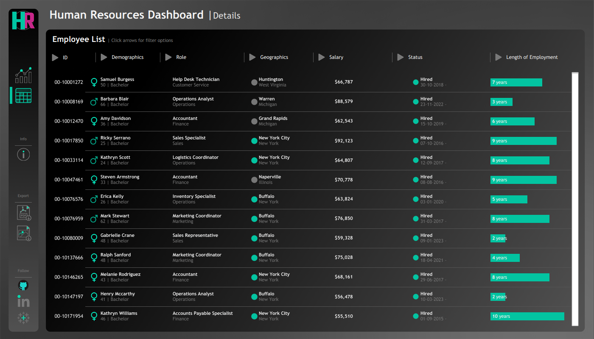
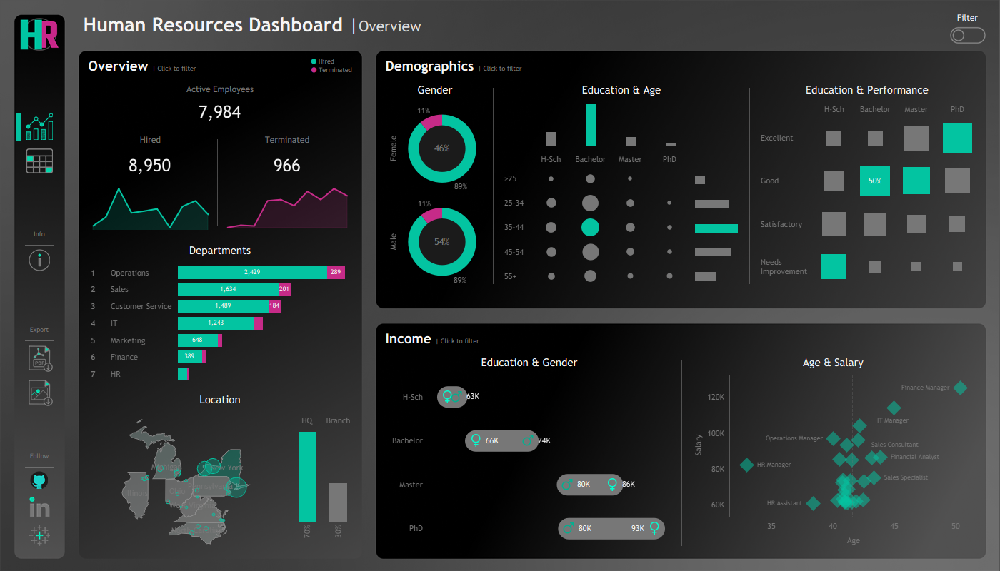

# 👥 HR Employee Attrition & Workforce Analytics Dashboard

## 📌 Project Background

**The Business Problem:**  
Employee attrition represents a massive, often hidden cost to organizations. High turnover not only incurs direct recruitment and onboarding expenses but also drains institutional knowledge and lowers team morale. This project analyzes a comprehensive HR employee dataset to identify the underlying patterns driving attrition.

The primary objective is to move beyond basic headcount reporting. By isolating high-risk employee segments based on department, age, and job role, this analysis empowers HR leadership to transition from reactive hiring to proactive, data-driven retention strategies.

### Key business areas analyzed:
- **📉 Overall Attrition Trends** – Quantifying turnover rates across the organization
- **🏢 Departmental Risk** – Identifying business units with the highest flight risk
- **🧑‍💼 Demographic & Role Segmentation** – Pinpointing specific age groups and job roles most likely to leave
- **🛡️ Retention Strategy** – Developing KPIs for ongoing workforce monitoring

---

## 🛠️ Data Architecture & Tools

The raw HR dataset underwent rigorous cleaning and preprocessing before being surfaced in an executive-ready dashboard.

- **Data Cleaning & Preprocessing:** Python (Pandas)
- **Dashboard & Visualization:** Power BI / Tableau

---

## 🎯 Executive Summary: Key Findings

The data analysis uncovered that attrition is not evenly distributed across the organization but concentrated in specific, identifiable segments:

- **Departmental Hotspots:** Certain departments exhibited significantly higher attrition rates, suggesting potential issues with management, workload, or career progression in those specific units.
- **At-Risk Demographics:** Attrition was notably prominent in specific age brackets and job roles, highlighting a potential mismatch between employee expectations and compensation/culture in those cohorts.
- **Workforce Imbalances:** The identified trends highlighted areas requiring immediate, targeted retention efforts to stabilize core operational teams.

---

## 🎯 The Outcome

- **Workforce Scale:** Analyzed a dataset of **8,950** employees, comprising **7,984** active and **966** terminated staff.
- **Key Attrition Metrics:** Identified an overall attrition rate of **10.8%** across a demographic split of **~54% male** and **46% female**.
- **Interactive Dashboards:** Delivered a Tableau solution featuring two interconnected views (HR Summary & Employee Details) with **~15 visualizations**.
- **Holistic Monitoring:** Provides data-driven insights into workforce demographics, departments, compensation, performance, locations, and employee status to support strategic retention planning.

---

## 💡 Actionable Business Recommendations

Based on the insights uncovered, the following data-driven interventions are recommended for HR stakeholders:

1. **Conduct Department-Specific Stay Interviews:** For the departments identified as high-risk, implement "stay interviews" to proactively uncover employee dissatisfaction before they submit a resignation.
2. **Tailor Retention Programs by Age/Role:** Develop targeted retention initiatives (e.g., mentorship programs, flexible working arrangements, or fast-tracked promotion paths) specifically designed for the highest-risk demographic and role segments.
3. **Continuous Workforce Monitoring:** Integrate the provided KPIs into monthly executive reporting to ensure workforce stability is tracked with the same rigor as financial performance.

---

## 📊 Dashboard Preview

The primary output of this project is a decision-ready interactive dashboard designed for non-technical HR stakeholders. 

 

**Dashboard Capabilities:**
- **Monitor Workforce Stability:** Quickly interpret overall attrition health.
- **Identify Risk-Prone Segments:** Drill down into specific departments or roles to isolate turnover causes.
- **Support Data-Driven Initiatives:** Export filtered lists of high-risk segments for targeted HR campaigns.

---

## 📬 Contact & License

**Abhinav Shandilya** - [LinkedIn Profile](https://www.linkedin.com/in/abhinavshandilya03/)  
**GitHub:** [AbhinavShandilya13](https://github.com/AbhinavShandilya13)
